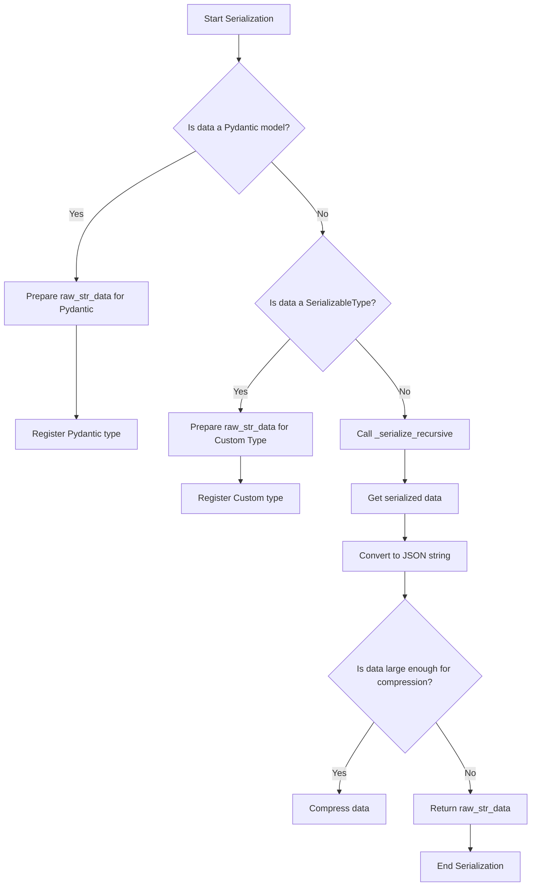
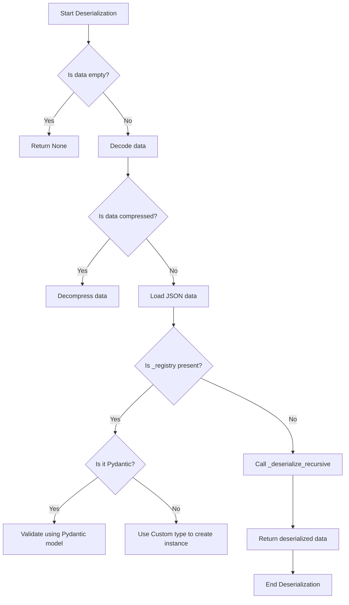

# Type Preservation in Redis Data Structures

This document explains how Python types are preserved when storing data in Redis using our data structures.

## Overview

Redis natively supports only a limited set of data types, and JSON serialization typically loses information about Python's rich type system. Our implementation preserves Python types through:

1. A type registry system for managing custom types
2. Built-in type handlers for common Python types
3. Automatic serialization/deserialization with type information
4. Pydantic model support for schema validation and complex types
5. Automatic compression of large data using zlib (configurable via `REDIS_DS_COMPRESSION_THRESHOLD` environment variable or `compression_threshold` in the `Config` class)

## Built-in Type Support

The following Python types are automatically preserved through built-in type handlers:

1. **Primitive Types**
   - `int`, `float`, `str`, `bool`, `NoneType`
   - Automatically preserved without special handling
   ```python
   hash_map.set("key", 42)  # int
   hash_map.set("key2", True)  # bool
   ```

2. **Collections**
   - `list`, `dict`, `set`, `tuple`
   - Nested structures maintain their type information
   ```python
   data = {
       "tuple": (1, 2, 3),
       "set": {4, 5, 6},
       "list": [7, 8, (9, 10)]
   }
   hash_map.set("nested", data)
   ```

3. **Date and Time**
   - `datetime` (preserved with timezone in ISO format)
   - `timedelta` (stored as total seconds)
   ```python
   from datetime import datetime, timezone, timedelta
   data = datetime.now(timezone.utc)
   hash_map.set("date", data)
   hash_map.set("duration", timedelta(hours=1))
   ```

4. **Binary Data**
   - `bytes` (preserved using hexadecimal encoding)
   ```python
   data = b"binary data"
   hash_map.set("bytes", data)
   ```

5. **Unique Identifiers**
   - `uuid.UUID` objects
   ```python
   import uuid
   data = uuid.uuid4()
   hash_map.set("id", data)
   ```

## Custom Type Support

### Standard Class Approach

For custom types, inherit from `SerializableType` and implement the required methods:

```python
from redis_data_structures.base import SerializableType

class User(SerializableType):
    def __init__(self, name: str, age: int):
        self.name = name
        self.age = age

    def to_dict(self) -> dict:
        return {
            "name": self.name,
            "age": self.age
        }

    @classmethod
    def from_dict(cls, data: dict) -> "User":
        return cls(data["name"], data["age"])

    def __eq__(self, other):
        # Override __eq__ for proper equality comparison
        return isinstance(other, User) and self.name == other.name and self.age == other.age
```

### Pydantic Integration

For complex types with validation requirements, use Pydantic models directly:

```python
from pydantic import BaseModel, Field
from datetime import datetime
from typing import Optional, Set

class Address(BaseModel):
    street: str
    city: str
    country: str
    postal_code: Optional[str] = None

class UserModel(BaseModel):
    name: str
    email: str
    age: int = Field(gt=0, lt=150)
    joined: datetime
    address: Optional[Address] = None
    tags: Set[str] = set()
```

See more examples here: [type_preservation_example.py](../examples/type_preservation_example.py), [serialization_example.py](../examples/serialization_example.py)

## Type Registration

### Automatic Registration

Types are automatically registered when you first store them in a Redis data structure:

```python
user = User("John", 30)
hash_map.set("user", user)  # User type is automatically registered

model = UserModel(name="Jane", email="jane@example.com", age=25)
hash_map.set("model", model)  # UserModel is automatically registered
```

### Manual Registration for Consumers

In distributed systems where some processes only consume data (without storing any), you need to manually register types before deserializing since the type registering is only automatically done when storing data:

```python
# In consumer processes, register types before reading data
hash_map = HashMap("my_key")

# Register custom types
hash_map.register_types(User)
hahs_map.register_types(UserModel)

# Or you can also register multiple types at once
hash_map.register_types([User, UserModel])

# Now you can safely deserialize data
user = hash_map.get("user")  # Will correctly deserialize as User instance
model = hash_map.get("model")  # Will correctly deserialize as UserModel instance
```

This is particularly important in scenarios like:
- Worker processes that only read from queues
- Read-only replicas or analytics services
- Monitoring or logging systems
- Any process that doesn't write data but needs to read it

## Implementation Details

### Type Registry System

The serialization system uses two registries managed by the `TypeRegistry` class:

1. **Custom Type Registry**: For classes inheriting from `SerializableType`
2. **Pydantic Type Registry**: For Pydantic models

```python
# Types are automatically registered during serialization
user = User("John", 30)
hash_map.set("user", user)  # Registers User class in custom type registry

model = UserModel(name="Jane", email="jane@example.com", age=25)
hash_map.set("model", model)  # Registers UserModel in pydantic registry
```

### Serialization Process



The serialization process follows these steps:

1. **Type Detection**
   - Checks if the value is a Pydantic model
   - Checks if the value is a SerializableType
   - Falls back to built-in type handlers

2. **Data Transformation**
   - Converts objects to a dictionary format with type information
   - Handles nested structures recursively
   - Preserves type information in the `_type` field

3. **Compression**
   - Large serialized data is automatically compressed using zlib
   - Compression threshold is configurable
   - Compressed data is marked with a special prefix

### Deserialization Process



The deserialization process:

1. **Compression Check**
   - Detects if data is compressed (checks for compression marker)
   - Decompresses if necessary

2. **Type Resolution**
   - Checks registry type (`_registry` field)
   - Uses appropriate registry to reconstruct objects
   - Falls back to built-in type handlers

3. **Object Recreation**
   - Reconstructs objects using registered type information
   - Handles nested structures recursively

## Best Practices

1. **Type Registration**
   - Register all types explicitly to avoid missing types when deserializing (important for consumer processes)
   - Keep type names unique across your application

2. **Performance Considerations**
   - Configure compression threshold based on your data size, default is 1024 bytes
   - Use appropriate serialization methods for your data types
   - Consider the overhead of complex nested structures

3. **Custom Type Implementation**
   - Always override `__eq__` in SerializableType subclasses
   - The default `__eq__` implementation compares `to_dict()` output, which may not be what you want
   - Implement proper equality comparison based on your type's semantics
   ```python
   def __eq__(self, other):
       return (
           isinstance(other, self.__class__) and  # Check type
           self.field1 == other.field1 and        # Compare relevant fields
           self.field2 == other.field2
       )
   ```

4. **Error Handling**
   ```python
   try:
       result = hash_map.get("key")
   except ValueError as e:
       logger.error(f"Unsupported type or serialization error: {e}")
   ```

## Limitations

1. **Circular References**
   - Not supported due to JSON serialization
   - Will raise RecursionError

2. **Dynamic Types**
   - Lambda functions and dynamic code cannot be serialized
   - File handles and sockets are not supported

3. **Type Consistency**
   - Type names must be consistent across your application
   - Changing class definitions may break deserialization

## Future Enhancements

1. **Additional Type Support**
   - Support for more built-in Python types
   - Custom type handler registration API

2. **Performance Optimizations**
   - Alternative compression algorithms
   - Lazy deserialization options
   - Caching improvements

3. **Developer Experience**
   - Enhanced error messages
   - Debug logging options
   - Type hint improvements

## Contributing

To add support for new built-in types:

1. Add a type handler to the `Serializer` class:
   ```python
   self.type_handlers["your_type"] = {
       "serialize": lambda x: {"_type": "your_type", "value": ...},
       "deserialize": lambda x: YourType(x["value"])
   }
   ```

2. Add tests for the new type handler
3. Update this documentation
4. Submit a pull request
